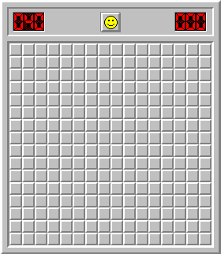
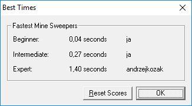
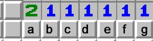

# A _simple_ minesweeper solver







It works only with _Minesweeper X_ that is is included.

But if you have a distribution that have exactly the same dimensions of a game and field, solver will work too!

It uses 2 algorithms:

Simple one:
```
Mines nearby = (number on a field) - (flaged fields nearby)
if (Mines nearby == uncovered fields nearby):
    flag all nearby fields.
if (Mines nearby == 0):
    uncover all nearby fiels.
```


More Advanced one using linear algebra:


```
The map:
a + b + c                 = 1
    b + c + d             = 1
        c + d + e         = 1
            d + e + f     = 1
                e + f + g = 1
                    f + g = 1
Solutions:
                e + f + g = 1
                    f + g = 1
                -------------
                e         = 0

    b + c + d             = 1
        c + d + 0         = 1
    -------------------------
    b = 0

Answer:
e and b are not a mine.
```
